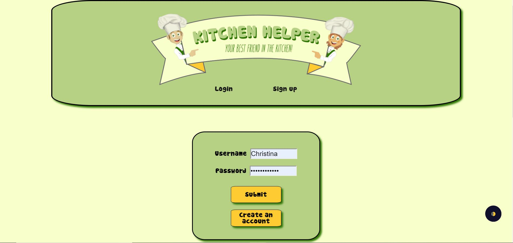
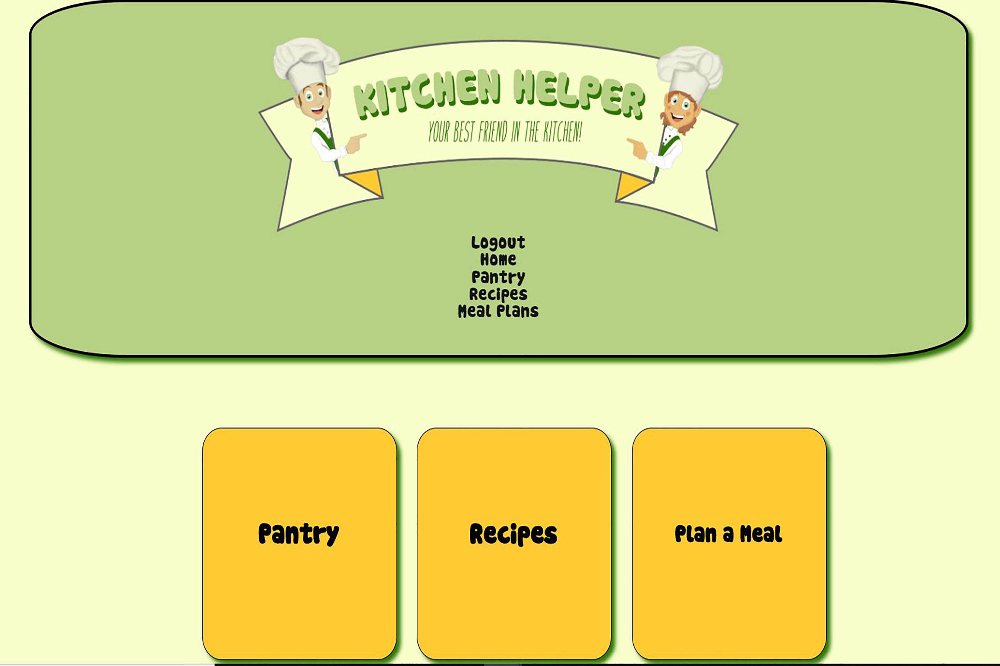
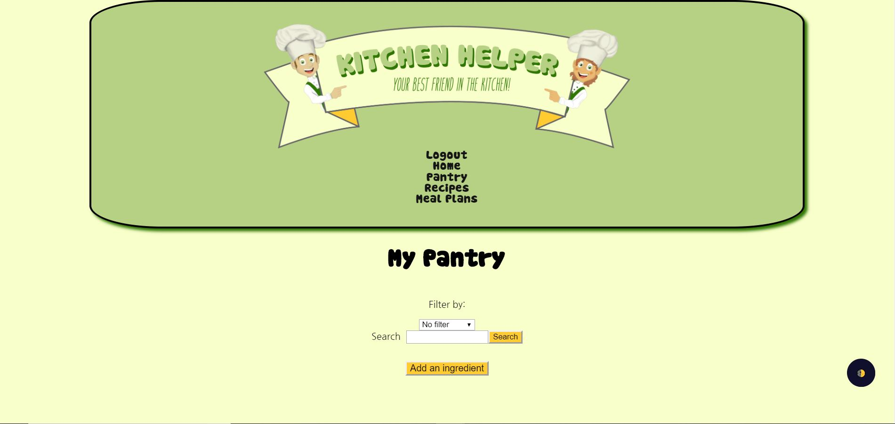
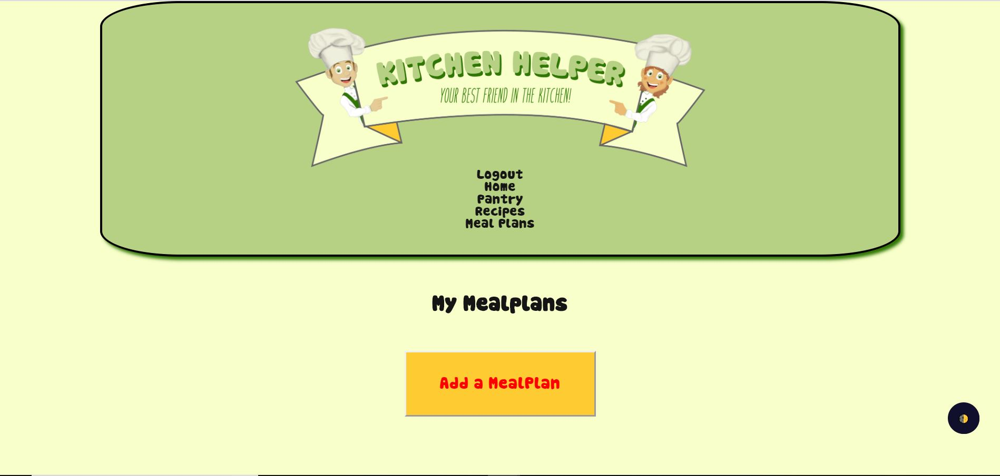
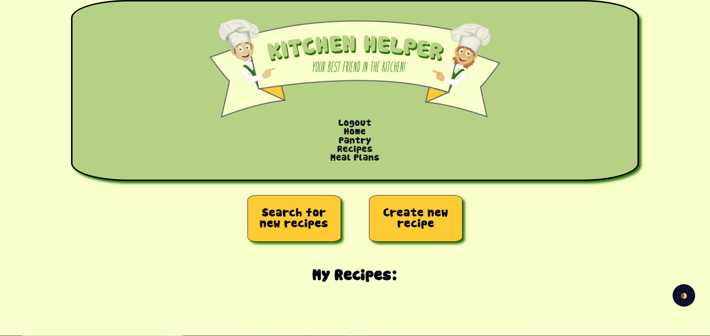
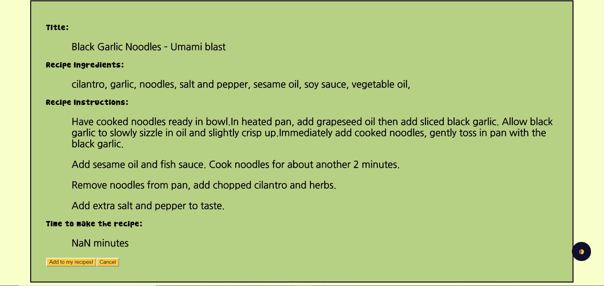

# Kitchen Helper:

    Kitchen Helper is a best friend in the kitchen. 
    This app combines the ability to track the items in your pantry, 
    the opportunity to plan your meals for a given time period and puts a 
    large database of recipes at your fingertips. This app also allows
    you to create and add your own recipes.

## Motivation:

    The motivation for this app was the idea that it would 
    help those that wish to be more organized and pro-active 
    in the kitchen.  It takes the guess work out of wondering 
    what you have in your kitchen to create meals.  So, if 
    you are someone who forgets easily, a busy parent that 
    feels frazzled about what to cook, or an older couple 
    looking to try something new, this app has something for everyone.

## Getting Started:   

  * [Client Side Repo](https://github.com/thinkful-ei-iguana/Delta-Squad-Front-End)

  * [Server Side Repo](https://github.com/thinkful-ei-iguana/Delta-Squad-Server)

  * [Live App](https://delta-squad-app.now.sh/)

## Screenshots:

    

    

    

    

    

    

## Technologies: 

   * Front End Tech: HTML, CSS, Javascript, React, Modal, Widgets(Dark Mode)

   * Back End Tech: NodeJs, ExpressJs, PostgresQl

   * Testing Tech: Jest, Snapshot, Enzyme, Lodash

## Core Features:

   * Ability to create/login with user accounts

   * Ability to add and filter ingredients in the pantry

   * Ability to track the stock level of your ingredients

   * Ability to search and display recipes, create new recipes

   * Ability to edit and delete recipes

   * Ability to create meal plans using the recipes and the pantry

   * Ability to select a recipe from ones owned by user and set    date for meal plan

   * Ability to display prep time and ingredients needed from the chosen recipe

## Upcoming Features:

   * Ability to create a favorite list of recipes

   * Ability to have a recent search result list

   * Ability to create a shopping list from the meal plan feature

   * Ability to use the camera and a barcode scanner to add items to your pantry and then in turn to the shopping list

## Code Example:

    Code For Modal Pop-up

        StyledModal = Modal.styled`
            display: flex;
            align-items: center;
            justify-content: center;
            background-color: white;
            opacity: ${props => this.props.opacity};
            transition: opacity ease 500ms;
        `;

        toggleModal = (e) => {
            this.setState({
            isOpen: !this.state.isOpen
            })
        }

## Contributors:

  * Maggie McClellan
  * Calvin Rosehart
  * Anugrah Lambogo
  * Christina Chapman

## Scripts and Deployment:

This project was bootstrapped with [Create React App](https://github.com/facebook/create-react-app).

## Available Scripts

In the project directory, you can run:

### `npm start`

Runs the app in the development mode. 
Open [http://localhost:3000](http://localhost:3000) to view it in the browser.

The page will reload if you make edits. 
You will also see any lint errors in the console.

### `npm test`

Launches the test runner in the interactive watch mode. 
See the section about [running tests](https://facebook.github.io/create-react-app/docs/running-tests) for more information.

### `npm run build`

Builds the app for production to the `build` folder. 
It correctly bundles React in production mode and optimizes the build for the best performance.

The build is minified and the filenames include the hashes. 
Your app is ready to be deployed!

See the section about [deployment](https://facebook.github.io/create-react-app/docs/deployment) for more information.

### `npm run eject`

**Note: this is a one-way operation. Once you `eject`, you can’t go back!**

If you aren’t satisfied with the build tool and configuration choices, you can `eject` at any time. This command will remove the single build dependency from your project.

Instead, it will copy all the configuration files and the transitive dependencies (Webpack, Babel, ESLint, etc) right into your project so you have full control over them. All of the commands except `eject` will still work, but they will point to the copied scripts so you can tweak them. At this point you’re on your own.

You don’t have to ever use `eject`. The curated feature set is suitable for small and middle deployments, and you shouldn’t feel obligated to use this feature. However we understand that this tool wouldn’t be useful if you couldn’t customize it when you are ready for it.

## Learn More

You can learn more in the [Create React App documentation](https://facebook.github.io/create-react-app/docs/getting-started).

To learn React, check out the [React documentation](https://reactjs.org/).

### Code Splitting

This section has moved here: https://facebook.github.io/create-react-app/docs/code-splitting

### Analyzing the Bundle Size

This section has moved here: https://facebook.github.io/create-react-app/docs/analyzing-the-bundle-size

### Making a Progressive Web App

This section has moved here: https://facebook.github.io/create-react-app/docs/making-a-progressive-web-app

### Advanced Configuration

This section has moved here: https://facebook.github.io/create-react-app/docs/advanced-configuration

### Deployment

This section has moved here: https://facebook.github.io/create-react-app/docs/deployment

### `npm run build` fails to minify

This section has moved here: https://facebook.github.io/create-react-app/docs/troubleshooting#npm-run-build-fails-to-minify
